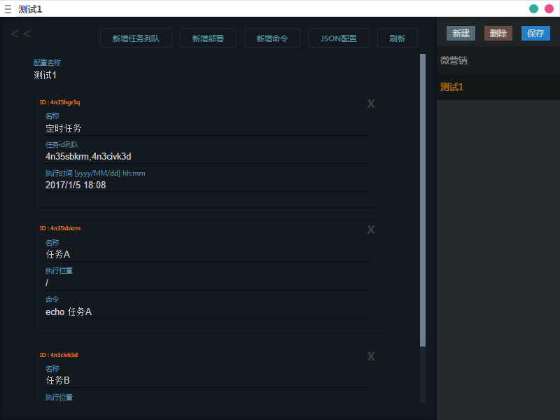

这个小工具的初衷是用于简化项目打包部署时的一些琐碎事情

###功能：
- 新建修改保存多个配置方案
- 执行本地命令
- 批量上传文件到服务器
- 定时执行组合任务(过期则直接执行)
- 新增显示JSON配置 方便把配置分享给别人


###Preparation
``` 
npm i -g electron 
npm i -g electron-packager
```
####Run
```
cd my-dev-tools/app
npm i
electron .
```
####Package
```
cd my-dev-tools
electron-packager app --platform=win32 --arch=x64 --icon=build/icon.ico --version=1.4.13 --overwrite
```
###Screenshot





